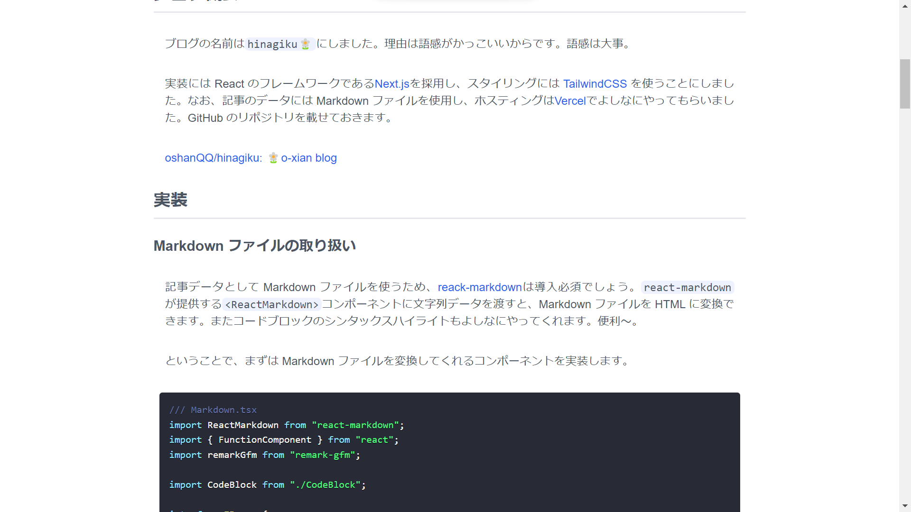

<h1>
  

    <code>
      <strong>
        hinagiku🌼
      </strong>
    </code>
  

</h1>

# 概要
技術ブログです。学習したことをまとめていきます。

# 機能
- Markdownから記事生成

# 使用技術
- Next.js 11.1.1
- TailwindCSS 2.2.7
- Vercel

# Link
- [Next.js + TailwindCSS + Markdownでブログを作った - hinagiku](https://hinagiku.vercel.app/posts/making-blog)
