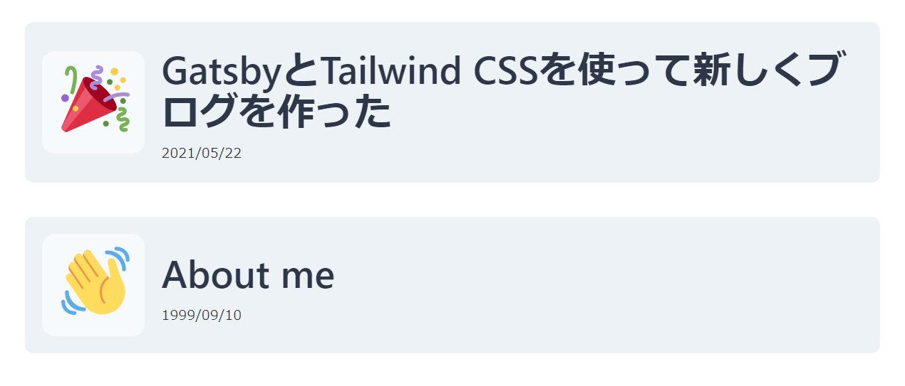

# はじめに

こんにちは、o-xian です。突然ですが、最近ブログを新しく作り直しました。今回はそんなブログ製作についてかるーく紹介していきたいと思います。

# 仕様技術

ぶっちゃけタイトルの通りですね。メインは Gatsby と Tailwind CSS です。名前だけでも聞いたことがあるんじゃないでしょうか。以下、開発のときに使用した技術について書いていきます。

### Gatsby.js

Gatsby.js は、React をベースに開発された静的サイトジェネレータです。ブログを開発するにあたって、とにかく **「早く記事を投稿したい！」** という感情が強かったので、スピード重視で `gatsby-blog-starter` を使わせていただきました 🙏。GitHub から clone するだけでブログシステムを導入できるのしゅごい。

ブログ投稿を Markdown ファイルで管理できるのも、Gatsby の採用理由の 1 つです。記事をファイル単位で管理できれば、今後ブログを作り直すことになってもファイルをまるごと移行させればいいですからね。らくちん。あと、そもそも記事を自分の手元(ローカル)で管理したいというのはありましたね。何気にこれが理由として一番デカい気がします。 ~~某ブログサイトの記事データが突然吹っ飛ぶ/運用終了するなんてことも、ありえなくはないですし~~

### tailwindcss

tailwindcss は、インラインっぽいスタイルで CSS を当てることができる CSS フレームワークです。さまざまなクラスを tailwindcss 側が提供してくれているので、そいつらをポチポチ組み込んでいけばガチの知識がなくてもそれっぽい感じにスタイルできます。特にレスポンシブデザインを組むときめっちゃ楽だと思います。

# デザインとか

投稿一覧画面には、サムネイルとして絵文字を採用しました。[catnose](https://twitter.com/catnose99)さんが[この記事](https://catnose99.com/blazing-fast-writing/)で言及されているデザインですね。[Zenn](https://zenn.dev/)ではおなじみのヤツです。この絵文字サムネイルが、現状すごく気に入っています。特に Twitter 上で表示される[Twemoji](https://twemoji.twitter.com/)という絵文字がめちゃくちゃ好きで、ブログを作るときは Twemoji のサムネイルは絶対入れたいと思っていました。かなりいい感じに表示できて、個人的にしっくりきています。

# 終わりに

すごい雑な紹介になりましたが、個人的にこれからいろいろ機能を拡張していきたいと考えています。TypeScript も使っていませんし、将来的に タグ機能とか RSS 機能とかも追加したいですね。それでは！👋
