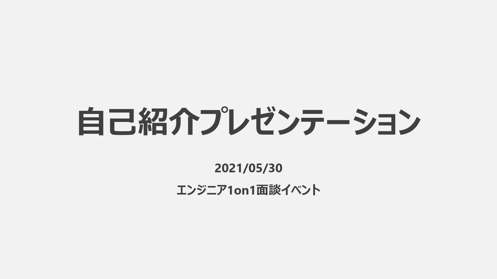
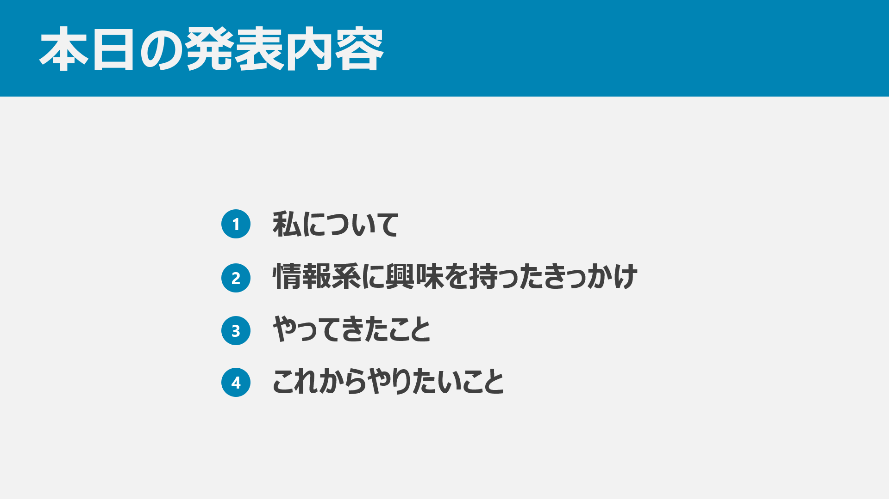

こんにちは、o-xian です。実は先日、サポーターズ主催の 1on1 面談イベント（以下、1on1）に参加してきました。今回はこの 1on1 について書いていきたいと思います。

# ノリで応募したら受かった

> これは本質情報ですが、4 月からもう 23 卒向け逆求人イベントが始まるので予定が空いてる人は受けた方がいい。
> あと時期によって参加する企業さんも変ってくるから機を逃さないでほしい。

と言われているくらい、B3/M1 の時期は重要（らしい）です。実際、私の周りの 23 卒学生も続々とインターンに応募していました。その状況で、私もなんとなく「逆求人出てみるか」と思っていました。そこで、エンジニア志望学生の間では（おそらく）一番有名なサポーターズの 1on1 面談イベントに申し込むことにしました。

 

イベントのエントリーシートには、自身の経歴・制作物・SNS のリンク（GitHub, Qiita, 個人ブログ etc...）などを書く欄がありました。1on1 では初めての応募でしたが、企業の方は多分この ES を重点的に読まれるよなぁ、となんとなく思いました。なので、ここは結構時間かけて、できるだけたくさん書くようにしました。400 字以上 1000 字以下という文字数制限が結構きつかったですね。書きたいことがたくさんあったのですが、泣く泣く削除してました 😭

で、サポーターズに応募フォームを送って、数日後にぬるっと合格してしまいました。やったぜ。  
割と前日まで参加するという実感が湧かなかったため、自己紹介プレゼン作成をギリギリまでやらなかったのは怠惰でしたね。深夜 2 時半くらいまでスライド作っていたのは頭悪かったです。

当日使ったスライドには個人的な内容をゴリゴリ載せていたので、いくつかスライドを抜粋して載せておきます。

# いざ当日

当日は Zoom 上でオンライン形式で行われました。某パンデミック以前はオフラインで開催されていたようで、多分オフラインだったら参加は厳しかったですね。九州住みなので… ~~けがの功名でしたっけ~~

午前中は、企業の方から 5 分間の企業紹介プレゼンがありました。当日は 13 もの企業が参加されていました。この時間で、学生は各企業が力を入れている所・インターンの情報などを知ることができました。企業のプレゼンが終わったら、その企業に対して抱いた印象・面談希望度などをアンケートで回答していきます。

そして午後からいよいよ面談開始です。各学生には 8 タームの面談時間が設けられました。各タームで企業から面談を入れられたら、そのタームは面談の時間です。私は 8 ターム中 7 タームが面談で埋まっていましたので、ほぼぶっ続けで企業の方と話をしました。25 分間全集中して企業の方と話をするわけですから、まぁ疲れました。ただ、途中の方から「気合入れて話をする部分」と「肩の力を抜いて楽に話をする部分」の切り替えがなんとなく分かってきたので、うまいこと精神力を保てたかな、と思います。

こうして短時間で面談をぶん回していくなかで話した内容を、いくつか共有しておきたいと思います。

### 企業の方からされた質問

- 今まで一番力入れたプロダクトは何ですか？また、どんなところを工夫しましたか？

これは結構答えやすかったですね。直近で制作中だったポートフォリオサイトを挙げて、サイトを組む上でのアーキテクチャ辺りの話をしました。

- ES に「自由なスタイルで働きたい」と書いてありましたが、どういうことはもうちょと詳しく教えてください。

これはちょっと答えづらかったです。私自身持病を持っていて、就職の時はあまりそのことを公にしないつもりだったので。質問されたときはしっかり病気持ちであることを言いましたよ。

### 評価

各企業と面談が終わったあと、学生に対して面談のフィードバックを貰えます。当日の私の評価はこんな感じでした。

- コミュニケーション能力
- コミュニケーション能力
- 意志・意欲
- コミュニケーション能力
- コミュニケーション力
- 技術力
- 技術力

個人的にコミュニケーション力はある方だと思っていましたが、意志・意欲と技術力が評価されているのはかなり以外でした。またこれとは別に、スライドについてお褒めのコメントをくださった企業が複数ありました。こういうのは変に謙遜せずに、「自分では気づかないような強みを評価していただいた！いいはなし！」くらいのスタンスでいると、精神衛生上ハッピーな気がします。

# まとめ

1on1 イベントは、人によって得られるものがかなり異なってくると思っています。私の場合は、「技術力を強みにインターン・就職の足がかりにする」というよりは、「今まで行ってきた活動をもとに、これからやるべき内容をフィードバックしてもらう」「面接の練習」といった意味合いが強かったです。実際に参加して、これらの点以外にもかなり多くの学びがありました。「1on1 イベントにまだ行ったことがない」という人は、絶対に行った方がいいと思います。いろいろ経験できて（さらにサポーターズ主催の 1on1 ならお金ももらえる）たくさんお話を聞けると思います。

# 追記

1on1 繋がりでインターンが 1 社決まりました！やったぜ！
