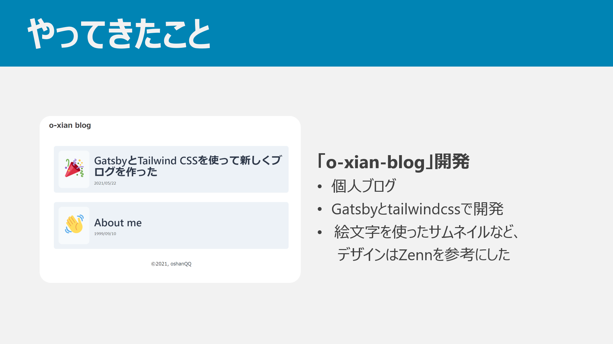

こんにちは、o-xian です。実は先日、サポーターズ主催の 1on1 面談イベント（以下、1on1）に参加してきました。今回はこの 1on1 について書いていきたいと思います。

# ノリで応募したら受かった

> これは本質情報ですが、4 月からもう 23 卒向け逆求人イベントが始まるので予定が空いてる人は受けた方がいい。
> あと時期によって参加する企業さんも変ってくるから機を逃さないでほしい。

と言われているくらい、B3/M1 の時期は重要（らしい）です。実際、私の周りの 23 卒学生も続々とインターンに応募していました。その状況で、私もなんとなく「逆求人出てみるか」と思っていました。そこで、エンジニア志望学生の間では（おそらく）一番有名なサポーターズの 1on1 面談イベントに申し込むことにしました。

イベントのエントリーシートには、自身の経歴・制作物・SNS のリンク（GitHub, Qiita, 個人ブログ etc...）などを書く欄があります。1on1 は初めての応募でしたが、「企業の方は多分この ES を重点的に読まれるよなぁ」と思いました（ES の内容的に）。なので ES は結構時間かけて、できるだけ丁寧に書くよう心がけました。400 字以上 1000 字以下という文字数制限が結構きつかったですね。書きたいことがたくさんあったのですが、泣く泣く削っていました 😭

で、サポーターズに応募フォームを送信した結果、数日後にぬるっと合格してしまいました。やったぜ。  
1on1 イベントでは、学生が当日の面談時間に自己紹介プレゼンを行うので、スライドを準備する必要がありました。私は以下の項目でスライドを作成しました。

- 自己紹介
- 情報系に興味を持ったきっかけ
- いままで行ってきたこと
- これからやりたいこと

割と前日まで参加するという実感が湧かなかったため、自己紹介プレゼンはギリギリまで作らなかったです。怠惰でしたね。夜 2 時半くらいまでスライド作っていたのは頭悪かったと思います。

当日使ったスライドには個人的な内容がゴリゴリ書かれていたので、いくつかスライドを抜粋して載せておきます。

# いざ当日

当日は Zoom 上でオンライン形式で行われました。2 年前はオフラインで開催されていたようです。私は九州住みなので、多分オフラインだったら参加は厳しかったですね…~~某ロナウイルスの功罪~~

午前中は、企業の方から 5 分間の企業紹介プレゼンがありました。当日は 13 もの企業が参加されていました。この時間で、学生は各企業が力を入れている所・インターンの情報などを知ることができました。企業のプレゼンが終わったら、その企業に対して抱いた印象・面談希望度などをアンケートで回答していきます。

そして午後からいよいよ面談開始です。各学生には 8 タームの面談時間が設けられました。各タームで企業から面談を入れられたら、そのタームは面談の時間です。私は 8 ターム中 7 タームが面談で埋まっていましたので、ほぼぶっ続けで企業の方と話をしました。25 分間全集中して企業の方と話をするわけですから、まぁ疲れました。ただ、途中の方から「気合入れて話をする部分」と「肩の力を抜いて楽に話をする部分」の切り替えがなんとなく分かってきたので、うまいこと精神力を保てたかな、と思います。

各企業と面談が終わったあと、学生に対して面談のフィードバックを貰えます。当日の各企業（名前は伏せます）の評価はこんな感じでした。

- コミュニケーション力
- コミュニケーション力
- 意志・意欲
- コミュニケーション力
- コミュニケーション力
- 技術力
- 技術力

怒涛のコミュニケーション力。まあプレゼン発表には慣れていたので、相応の評価なのかな、と思います。意志・意欲と技術力が評価されているのは以外でした。またこれとは別に、複数の企業からスライドの構成についてお褒めのコメントをいただきました。こういうのは変に謙遜せずに、「自分では気づかないような強みを評価していただいた！いい話！」くらいのスタンスでいると、精神衛生上ハッピーな気がします。

# まとめ

1on1 イベントは、私の場合は「技術力を強みにインターン・就職の足がかりにする」というよりは、「今まで行ってきた活動をもとに、これからやるべき内容をフィードバックしてもらう」「面接に慣れておく」といった意味合いが強かったです。しかし実際に参加してみると、自分が思っていた以上にいろいろな経験ができました。企業の事も知ることができましたし、インターンなどの情報も一足先に知ることができました。1on1 イベントで学生や企業の方と知り合う、ということもあるのではないでしょうか。  
「1on1 イベントにまだ行ったことがない」という人は、絶対に行った方がいいと思います。いろいろ経験できて（さらにサポーターズ主催の 1on1 ならお金ももらえる）、めっちゃ得られるものがあると思いますよ～。

# 追記

1on1 繋がりでインターンが 1 社決まりました！やったぜ！🙌
